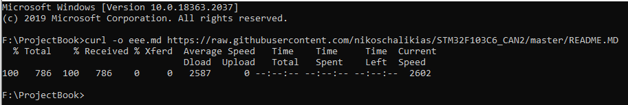

# [ProjectBook](https://github.com/nikoschalikias/ProjectBook) 

Integration of multiple projects README.md to a single document

## Using gget
> *  For windows gget is a small downloadable **.exe** file
> *  For gget to work, a Release must exist in the remote github repo
> *  git Releases are based on tags  
> *  git tags are created locally and then pushed to github remote repo  
> *  A git Release can be created from gitHub web interface or from the locally installed gh-cli

----

## Links

*  [gget](https://gget.io/#install)
*  [tubeToolHolder](https://github.com/nikosLab/tubeToolHolder)
*  [git  tag](https://git-scm.com/book/en/v2/Git-Basics-Tagging)
*  [Git Releases](https://docs.github.com/en/repositories/releasing-projects-on-github/about-releases)
